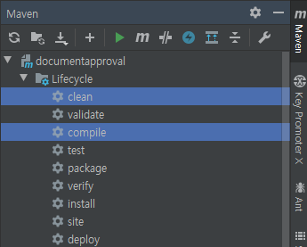
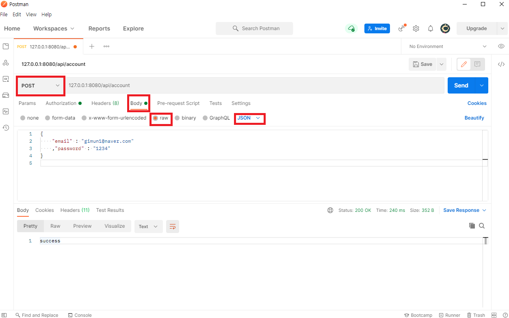
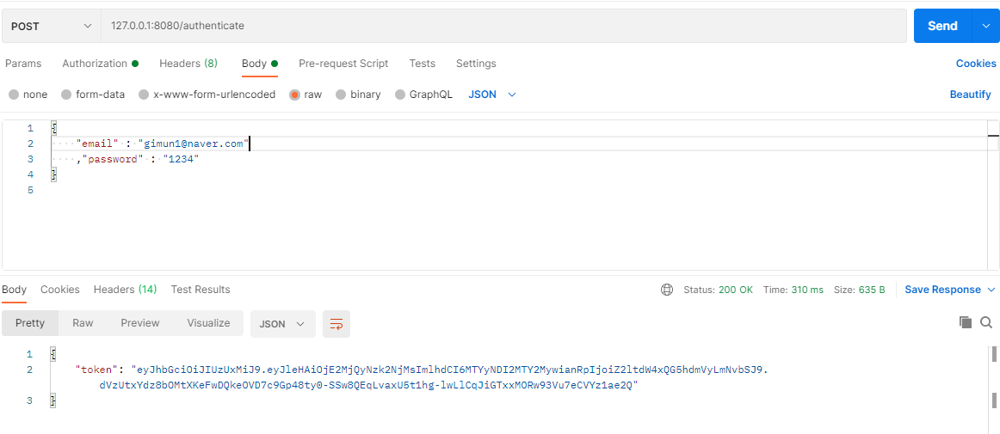
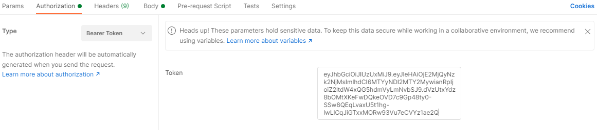
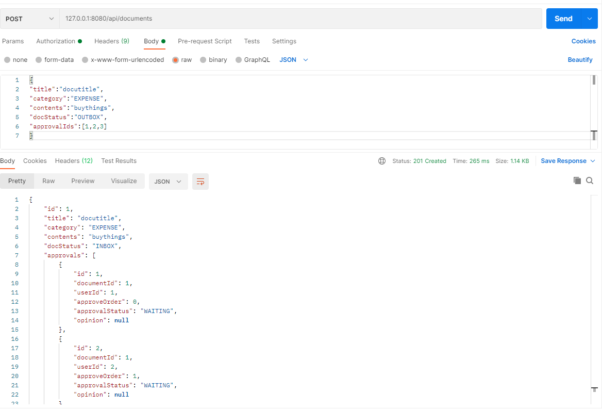
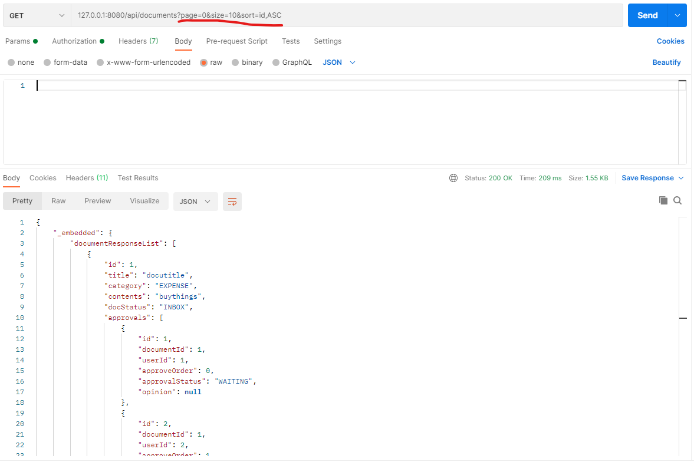
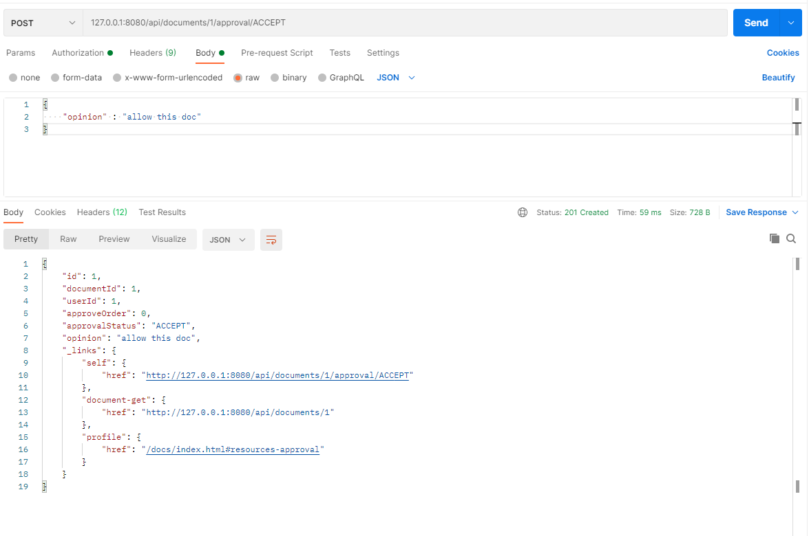

## 전자결재 API서버 사용 시나리오

### 프로젝트 개발 환경
    - spring boot
    - lombok
    - spring hateoas
    - spring restdocs
    - DB 관련
        - h2
        - spring data jpa
        - querydsl
    - 인증
        - spring secority
        - jsonwebtoken

#### 1. 프로젝트 빌드
    - 프로젝트 셋팅후 querydsl 사용을 위해 빌드 수행
    - maven 라이프사이클 활용하여 clean compile



#### 2. 프로젝트 실행
- DocumentapprovalApplication 에서 서버 run
```java
    @SpringBootApplication
    public class DocumentapprovalApplication {
    
        public static void main(String[] args) {
            SpringApplication.run(DocumentapprovalApplication.class, args);
        }
    
        @Bean
        public PasswordEncoder passwordEncoder() {
            return new BCryptPasswordEncoder();
        }
    
    }
```

#### 3. Postman으로 api 사용
- 사용자 생성
- 127.0.0.1:8080/api/account 로 사용자 생성
- request body
```json
   {
       "email" : "gimun1@naver.com"
       ,"password" : "1234"
   }
```    
- 테스트 위해 gimun2, gimun3등 으로도 미리 계정 생성 

    

#### 4. authorization type 설정 후 토큰 생성 및 설정        
- Authorization > Type > Bearer Token 설정 

- 127.0.0.1:8080/authenticate 로 인증 토큰 생성

    

- 생성된 토큰 설정
    

- 테스트 위해 gimun2, gimun3 계정도 해당 계정으로 사용시에 토큰 생성

#### 5.문서 생성
- 127.0.0.1:8080/api/documents
- request body
    ```json
      {
      "title":"docutitle",
      "category":"EXPENSE",
      "contents":"buythings",
      "docStatus":"OUTBOX",
      "approvalIds":[1,2,3]
      }
    ```
    - 테스트를 위해 문서 하나 더 생성
    ```json
      {
      "title":"docutitle2",
      "category":"VACATION",
      "contents":"want rest",
      "docStatus":"OUTBOX",
      "approvalIds":[1,2,3]
      }
    ```
    


#### 5. 사용자 문서 목록 조회 
- 페이지 파라미터 설정
    - http 요청 메소드 GET
    - 127.0.0.1:8080/api/documents?page=0&size=10&sort=id,ASC
    
    
#### 6. 문서 조회
- 단일 문서 조회 
    - http 요청 메소드 GET
    - 문서번호를 path 에 추가
    - 127.0.0.1:8080/api/documents/1
    
    
#### 7. 결재 승인
- 문서 결재
    - http 요청 메소드 POST
    - 문서 번호 및 결재 상태를 PATH에 추가 documents/문서번호/approval/결재상태(ACCEPT,REJECT)
    - 127.0.0.1:8080/api/documents/1/approval/ACCEPT
    - request body
    ```json
     {
               "opinion" : "allow this doc"
           }
    ```
    
    - GET 127.0.0.1:8080/api/documents/1 요청하여 확인시 아래와 같이 approvals의 상태 및 의견이 변경됨.
    ```json
      {
          "id": 1,
          "title": "docutitle",
          "category": "EXPENSE",
          "contents": "buythings",
          "docStatus": "INBOX",
          "approvals": [
              {
                  "id": 1,
                  "documentId": 1,
                  "userId": 1,
                  "approveOrder": 0,
                  "approvalStatus": "ACCEPT",
                  "opinion": "allow this doc"
              },
              {
                  "id": 2,
                  "documentId": 1,
                  "userId": 2,
                  "approveOrder": 1,
                  "approvalStatus": "WAITING",
                  "opinion": null
              },
              {
                  "id": 3,
                  "documentId": 1,
                  "userId": 3,
                  "approveOrder": 2,
                  "approvalStatus": "WAITING",
                  "opinion": null
              }
          ],
          "_links": {
              "self": {
                  "href": "http://127.0.0.1:8080/api/documents/1"
              },
              "approval": {
                  "href": "http://127.0.0.1:8080/api/documents/{documentId}/approval/{approvalStatus}",
                  "templated": true
              },
              "profile": {
                  "href": "/docs/index.html#resources-document-get"
              }
          }
      }
    ```

